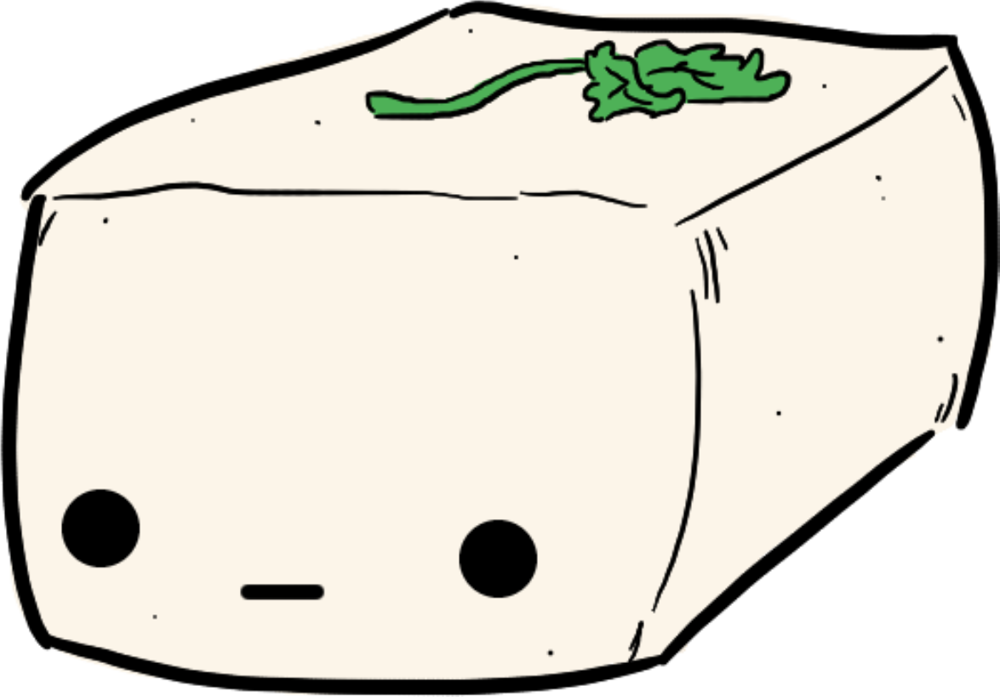

# Tofu's Paladins Loadout Importer

Bulk Paladins loadout importer from a source account with GUI. It'll automate your mouse clicks to import selected champion loadouts from a target account.

## Installation

### From Build (Recommended)
Download **`PaladinsLoadout.exe`**; double-click to run, edit `config.yml` to change the timings.

> On first run Windows may show a blue "Windows protected your PC" screen (the
> app isn't code-signed). Click **More info -> Run anyway**.

### From Source

1. **Use `run.bat`**
> Double-click **`run.bat`**. It will install `uv` if you don't have it and then launch the app.

2. **Use CLI**: three ways to install: via `uv`, `conda`, `pip`.

```bash
# uv + gitbash (recommended)
curl -LsSf https://astral.sh/uv/install.sh | sh # if uv not installed
uv sync
uv run python main.py
```

```bash
# conda
conda create -n paladins-loadout python=3.13
conda activate paladins-loadout
pip install -e .
python main.py
```

```bash
# pip
python -m venv .venv
source .venv/Scripts/activate
pip install -e .
python main.py
```

## Usage

### Prerequisites
- on Windows
- Paladins resolution 1920x1080
- Paladins on primary monitor
- Paladins is launched and at the Home Screen

### Features
- Give any "source username" and it will import from that account
- Auto-import all loadouts from multiple champions (it will take control of your mouse)
> F1 (default hotkey) to start import on the selected champions; F2 (default hotkey) to interrupt any ongoing import
- Import selected loadouts from one champion (e.g., "I only want loadouts 1,4,7-9 from Inara")
- After the first time running the application this session, auto-switch to a "speedy" import that will skip setting up of the champion selection screen and typing in the name of the account on each successive loadout import

## Troubleshooting
- Double-check that you have your Paladins in the right resolution & display mode (see pre-reqs)
- Simply interrupt/cancel the import, return to homescreen, and try again; Paladins sometimes bugs out
- If it messes up multiple times, see if the delay time between the auto-clicks is too short. You can manually edit these delays in config.yml to be longer to ensure that menus load ingame before you click (i.e. if your computer or the Paladins server is slow to load.)